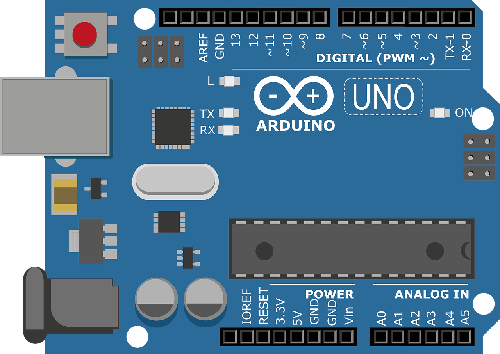
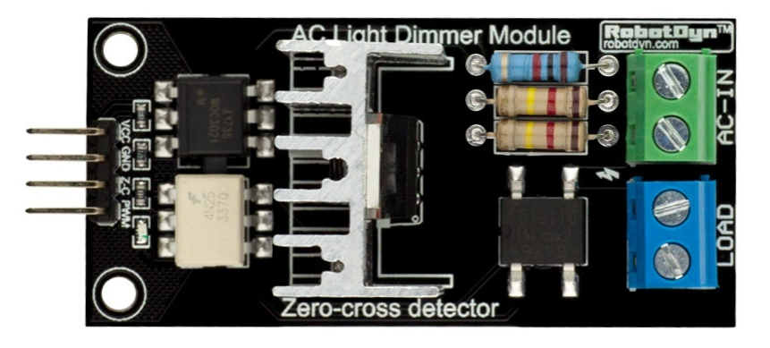

# AC Dimmer Control with Arduino

 

## What it does?
Controls power in AC load through a TRIAC, perfomring AC phase cutting with help of a zero-cross detection circuit in a dimmer module. The module used was a [RobotDyn AC Dimmer] module paired with an Arduino Uno board.

It is also possible to use similar modules, that work in the same way, or do the circuit yourself. That are plenty of tutorials online explaining how it works.

An incandescent light bulb was used as the load, allowing the visualization of the power control trough the light brightness. But it works with any AC resistive load where the current or voltage don't exceed the dimmer circuit specified capacity.

## Advantages
Many sketches online uses delay() to make the interrupt routine wait to trigger the TRIAC. But it can lead to very long interrupts at low power. In the implementations on this repository, the Arduino hardware timer (Timer1) was used, making the interrupt at the zero-crossing non-blocking.

There is also libraries provided by manufacturers of this kind of module. RobotDyn suggests it's own library. The disadvantage of this approach is that you don't have full control over the TRIAC. 
Particularly, I've experienced flickering in the light bulb when trying to combine the dimming functionality through the library with other things, such as measuring and displaying temperature with a DS18B20.

## What's the difference between the sketches?
There are two Arduino sketches in this repository:

### ac-dimmer-user-input
Here you can control the time to trigger the TRIAC manually by a Serial input (you can use the Arduino IDE Serial Monitor to give inputs) with the power level desired, going from 1% to 100%, which is then converted to the time to trigger the TRIAC, resulting in more or less power delivered to the load.
 
 
### ac-dimmer-with-temperature
It is the same, but paired with a DS18B20 temperature sensor, in which the temperatures are being read also in a non-blocking way and allowing the loop to keep running. Nothing is actually being done with the temperature, just the monitoring.

[RobotDyn AC Dimmer]: https://robotdyn.com/ac-light-dimmer-module-1-channel-3-3v-5v-logic-ac-50-60hz-220v-110v.html